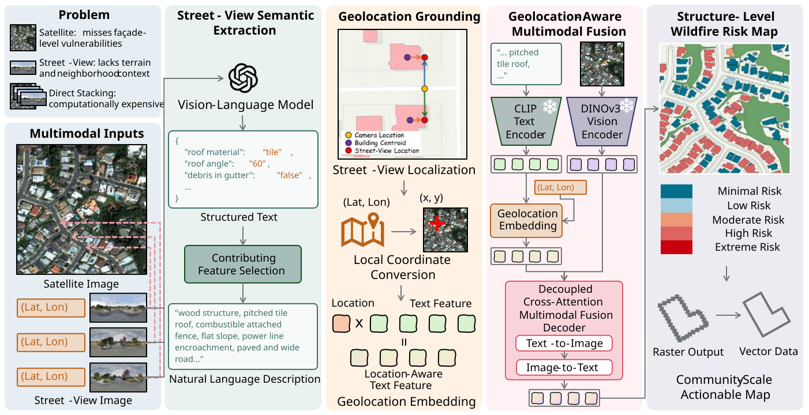

<div align="center">
<h1 align="center">Wildfire-SSR</h1>

<h3>Wildfire-SSR: Geolocation-Aware Multimodal Fusion for Structure-Level Wildfire Risk Assessment</h3>

[Yu-Hsuan Ho](https://scholar.google.com/citations?user=UCb9yDoAAAAJ)<sup>a *</sup>,
[Yiming Xiao](https://scholar.google.com/citations?user=-R4lQU0AAAAJ)<sup>a</sup>,
[Hao-En Lai](https://scholar.google.com/citations?user=Med3PnMAAAAJ)<sup>b</sup>,
[Ali Mostafavi](https://scholar.google.com/citations?user=DFNvQPYAAAAJ)<sup>a,c</sup>,
[Samuel D. Brody](https://scholar.google.com/citations?user=wFHeGocAAAAJ)<sup>c</sup>

<sup>a</sup> Urban Resilience.AI Lab, Zachry Department of Civil and Environmental Engineering, Texas A\&M University.

<sup>b</sup> Artie McFerrin Department of Chemical Engineering, Texas A\&M University, College Station, TX

<sup>c</sup> Institute for Disaster Resilient Texas, Texas A\&M  University, Houston, TX

<sup>*</sup> Corresponding author
</div>


[]()

[**Overview**](#overview) | [**Getting Started**](#getting-started) | [**Citation**](#citation)


## Updates
* **` April 23th, 2026`**: The model and scripts for training and inference have been uploaded.

## Overview

**Wildfire-SSR** is a geolocation-aware multimodal model for structure-level wildfire risk assessment. It fuses high-resolution satellite imagery with location-tagged street-view captions describing structural attributes and jointly predicts building footprints and per-building wildfire risk class. The vision backbone is a satellite-pretrained DINOv3 encoder; text is encoded with CLIP and injected into the decoder via a geolocation-embedding that preserves the pixel-space location of each caption.

<p align="center">
  
</p>


## Getting Started

### `A. Installation`

**Step 1: Clone the Wildfire-SSR repository**

```bash
git clone {{TODO: repo URL}}
cd Wildfire-SSR
```

**Step 2: Clone DINOv3 into `models/`**

Wildfire-SSR depends on Meta's [DINOv3](https://github.com/facebookresearch/dinov3) code, which is not vendored in this repo. Clone it into `models/dinov3`:

```bash
cd models
git clone https://github.com/facebookresearch/dinov3.git
cd ..
```

**Step 3: Environment setup**

Create a conda environment from [environment.yml](environment.yml):

```bash
conda env create -f environment.yml
conda activate wildfiressr
```

### `B. Download Pretrained Weights`

Download the satellite-pretrained DINOv3 ViT weights from the [DINOv3 model hub](https://ai.meta.com/resources/models-and-libraries/dinov3-downloads/) (the SAT-493M checkpoints) and place them under:

```bash
{PROJECT_PATH}/WildfireSSR/models/dinov3/dinov3/pretrained_weight/
```

`Wildfire-SSR` supports four backbone sizes via `--model_size`: `Small`, `Base`, `Large` (default), `7B`. Make sure the downloaded weight file matches the size you plan to use, or pass the path explicitly via `--backbone_weights`.


### `C. Data Preparation`

Organize your dataset with the following structure:

```
${DATASET_ROOT}
├── splits
│   ├── Train_dataset.txt     # one image filename per line
│   ├── Valid_dataset.txt
│   └── Test_dataset.txt
├── Satellite_Imagery         # pre-event RGB satellite tiles (.tif)
│   ├── image_001.tif
│   └── ...
├── Building_Footprints       # binary building masks (.tif, same filename as imagery)
│   ├── image_001.tif
│   └── ...
├── Wildfire_Risk_Labels      # per-pixel risk-class labels (.tif, 5 classes + 255=ignore)
│   ├── image_001.tif
│   └── ...
└── Street_View_Text          # street-view captions with pixel coordinates (.json)
    ├── image_001.json
    └── ...
```

Each `Street_View_Text/*.json` file is an array of entries of the form:

```json
[
  {
    "text": {
      "structure type": "wood",
      "roof material": "tile",
      "roof angle": "135",
      "siding material": "stucco/cement",
      "siding-to-ground clearance present": "false"
    },
    "pixel_coord": [y, x]
  }
]
```

The loader converts `pixel_coord` to normalized coordinates and builds a CLIP caption from the structural fields — see [datasets/json_to_nl.py](datasets/json_to_nl.py) and [datasets/make_data_loader.py](datasets/make_data_loader.py).


### `D. Training`

```bash
python script/train_VisionLanguageSSR.py --batch_size 2 \
                                         --accumulation_steps 8 \
                                         --crop_size 512 \
                                         --max_epochs 100 \
                                         --geo_embed_type RoPE
```

Useful flags (see [script/train_VisionLanguageSSR.py](script/train_VisionLanguageSSR.py) for the full list):
- `--model_size {Small,Base,Large,7B}` — DINOv3 backbone size (default: `Large`).
- `--geo_embed_type {RoPE,RFF,none}` — geolocation embedding for the text branch (default: `RoPE`).
- `--resume /path/to/ckpt.pth` — resume training from a checkpoint.
- `--ablated_vision` — zero out vision features (text-only ablation).
- `--freeze_backbone` — freeze DINOv3 during training (default: True).

Checkpoints are written to `saved_models/{dataset}/{model_tag}_{timestamp}/` (`best_model.pth`, `latest_model.pth`) and logs to `log_files/{model_tag}_output_{timestamp}.txt`.


### `E. Inference`

```bash
python script/infer_VisionLanguageSSR.py --resume ./saved_models/TextRSDataset/DINOv3UNetVLBRV13_OneDec_Large_1772067278.9332561/best_model.pth
```

Useful flags (see [script/infer_VisionLanguageSSR.py](script/infer_VisionLanguageSSR.py) for the full list):
- `--save_images` — write per-tile PNG/GeoTIFF prediction maps.
- `--result_saved_path ./results` — output directory (default: `./results`).
- `--ref_tif_dir ../data/Satellite_Imagery` — reference tiles used to copy spatial metadata onto predicted GeoTIFFs.
- `--buffer 0.8` — evaluate metrics only on the centered fraction of each tile (default: None).

Console output reports per-class risk F1, harmonic-mean risk F1, and building-localization F1.


## Citation

If this code contributes to your research, please kindly consider citing our paper and give this repo ⭐️ :)

```
{{TODO: BibTeX entry for Wildfire-SSR}}
```


## Acknowledgments

This project builds on [DINOv3](https://github.com/facebookresearch/dinov3) (Meta FAIR) for the satellite-pretrained vision backbone and [CLIP](https://github.com/openai/CLIP) (OpenAI) for the text encoder. Users are responsible for complying with the respective model licenses. Thanks for their excellent work!

## Star History

[](https://www.star-history.com/#violayhho/Wildfire-SSR&Date)
